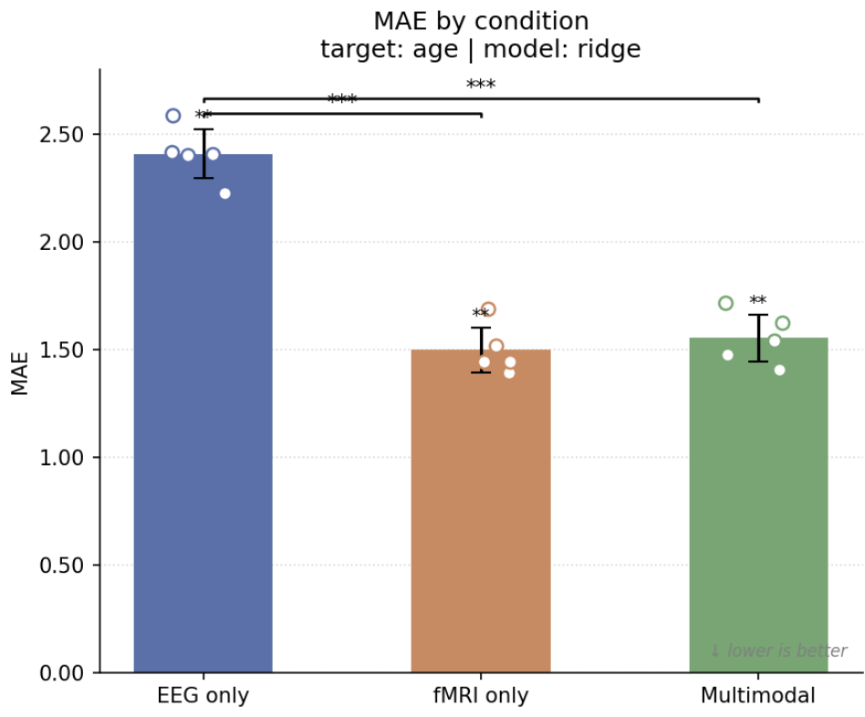
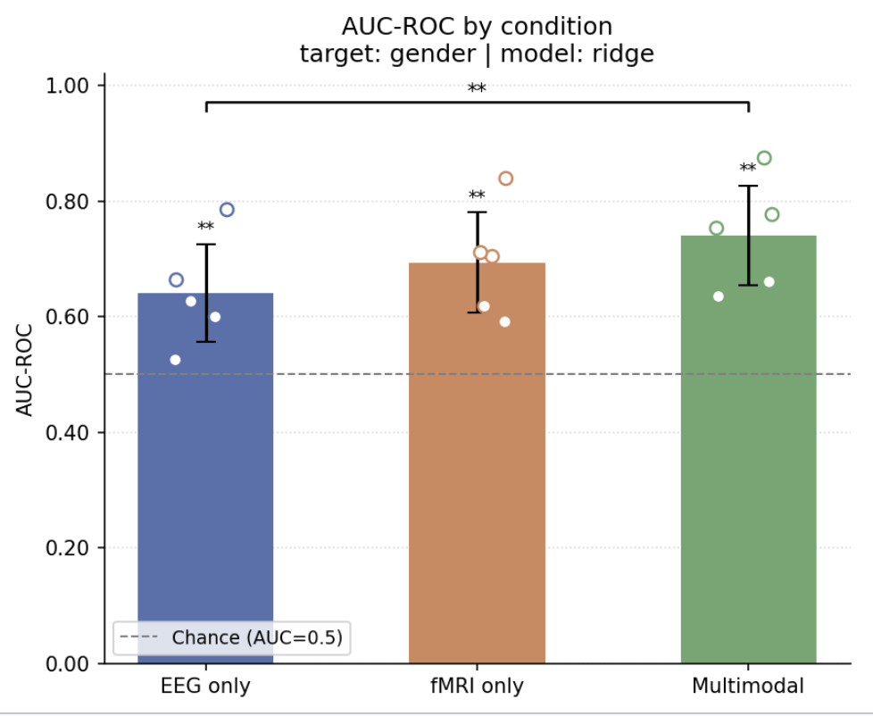
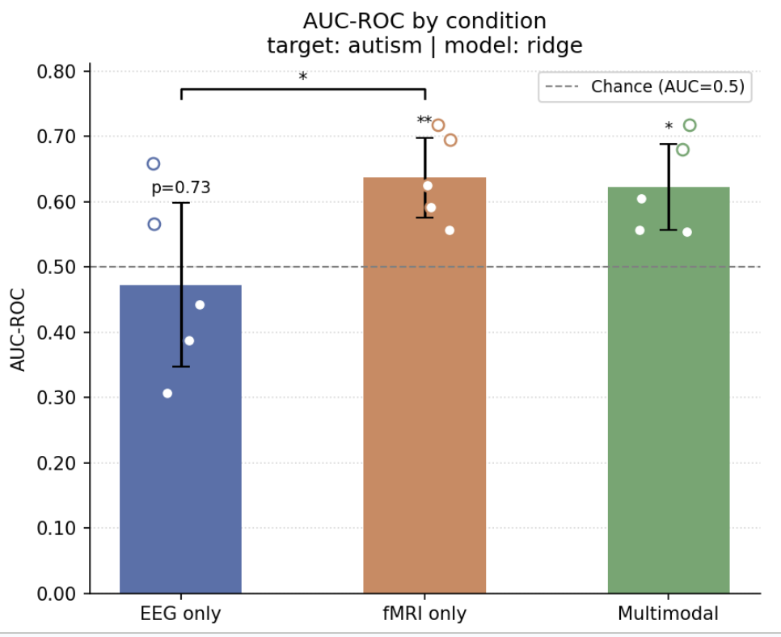
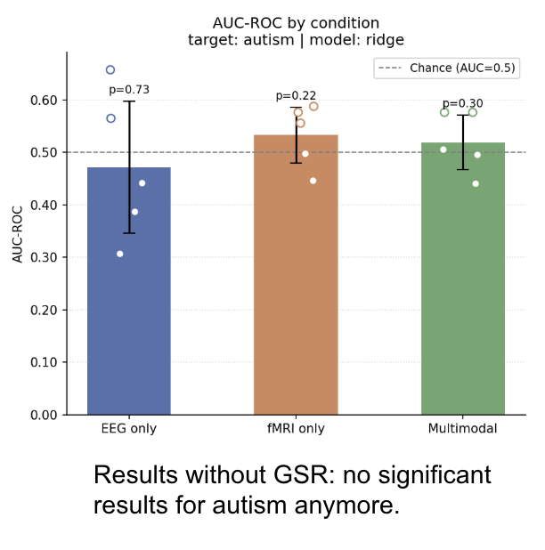

# NeuroMeld

<a href="https://github.com/pbergeret12">
  
  <br /><sub><b>Pierre Bergeret</b></sub>
</a>

### About Me

PhD Student in Psychiatry at the Université de Montréal specialized in neuroimaging analysis.

### Project slides

First presentation:

https://docs.google.com/presentation/d/1ZMddc8o5beXn3dZDECPOYwVRuh-DVODSOPS99YFSp7M/edit?slide=id.p#slide=id.p

Final presentation:

https://docs.google.com/presentation/d/1_PjdkNkijDH6QF2Ss8QrRItPPI3XfQpy/edit?slide=id.p1#slide=id.p1

---

## Introduction

**NeuroMeld** is a reproducible multimodal EEG/fMRI fusion pipeline for psychiatric
prediction, built for Brainhack School 2026 using the
[`airoh`](https://pypi.org/project/airoh/) task runner.

The pipeline trains three separate prediction models — one on EEG features alone, one on
fMRI connectivity features alone, and one on both combined — and compares them head to
head. The goal is to find out whether one modality, the other, or their fusion best
predicts a chosen phenotypic target (e.g. diagnosis, age, a clinical score). The primary
metric is **AUC-ROC** for classification and **MAE** for regression, and every result
comes with a permutation-based p-value against chance.

## Why combine EEG and fMRI?

EEG and fMRI are complementary windows onto brain activity, each with a different
strength:

- **fMRI** offers excellent **spatial resolution** — it tells you *where* in the brain
  activity and connectivity patterns live, down to the millimetre, but it is slow
  (seconds).
- **EEG** offers excellent **temporal resolution** — it tracks neural dynamics on the
  scale of milliseconds, capturing *when* things happen, but with poor spatial precision.

Most studies use one modality or the other. By fusing both, NeuroMeld lets you exploit
the spatial precision of fMRI *and* the temporal precision of EEG at the same time, and —
crucially — quantify whether that fusion actually buys you anything over either modality
on its own for a given prediction task.

## Methods

NeuroMeld is designed to work with **brain connectivity data** (fMRI) and **spectral EEG
features** such as band power. It expects a cohort of subjects who have data for **both
modalities** — only subjects present in EEG, fMRI, *and* the phenotype file are kept for
analysis.

**Required input — phenotype file.** Whatever the modality formats, you always need a
phenotype table in **TSV** format with (at minimum) the following columns:

| Column | Meaning |
|---|---|
| `participant_id` | Subject identifier — the key that links every input together |
| `age` | Subject age |
| `gender` | Subject gender |
| `study_site` | Acquisition site |

`age`, `gender`, and `study_site` are used as confounds and regressed out of the features
before prediction, so the models are not just learning site or demographic effects.

**fMRI input — two accepted formats:**
- **Halfpipe output** — a directory of connectivity matrices preprocessed by
  [Halfpipe](https://github.com/HALFpipe/HALFpipe). This is a per-subject folder layout,
  and **the subject folder names must match exactly the values in the `participant_id`
  column** of the phenotype file. Halfpipe is described in Waller, L., Erk, S., Pozzi, E.,
  Toenders, Y. J., et al. (2022). *ENIGMA HALFpipe: Interactive, reproducible, and efficient
  analysis for resting‐state and task‐based fMRI data.* **Human Brain Mapping**, 43(9),
  2727–2742. [doi:10.1002/hbm.25829](https://doi.org/10.1002/hbm.25829).
- **A flat TSV** — any TSV with a `participant_id` column (to link back to the phenotype
  file) and one column per feature. The feature columns can be anything you like.

**EEG input — two accepted formats:**
- **MNE-BIDS output** — a directory of EEG data formatted with
  [MNE-BIDS](https://mne.tools/mne-bids/). This is also a per-subject folder layout, and
  again **the subject folder names must match exactly the `participant_id` values** in the
  phenotype file. Band-power features are extracted automatically. A well-formatted example
  EEG-BIDS dataset can be found on OpenNeuro:
  [ds004107](https://openneuro.org/datasets/ds004107/versions/1.0.0).
- **A flat TSV** — any TSV with a `participant_id` column and one column per feature,
  exactly like the fMRI TSV case.

In short, you always provide three things: a **phenotype TSV**, one **fMRI input**
(Halfpipe directory *or* TSV), and one **EEG input** (MNE-BIDS directory *or* TSV). The
format of each input is auto-detected from its path — you do not need to declare it.

For the exact commands to configure these paths and run the pipeline, see the
[**Quick Start**](#quick-start) and the sections below it.

## Data

NeuroMeld was originally developed to help analyse the **HBN (Healthy Brain Network)**
dataset, which provides both resting-state EEG **and** resting-state fMRI for around
**850 participants**. That dataset cannot be shared publicly here for legal reasons, so it
is not included in this repository.

The tool can still be tried out by anyone, thanks to **synthetic data**. The
`analysis/generate_synthetic.py` generator produces a small cohort of fake subjects in all
four supported input formats (Halfpipe-style directory and flat TSV for fMRI, MNE-BIDS
directory and flat TSV for EEG), with a weak but real signal so the pipeline produces
meaningful results. The following sections show how to generate this data and run the full
pipeline end to end with a single `invoke` command (see `invoke generate-smoke-data` and
`invoke run-smoke`).

## Tools learned during the project

This project was also a chance to learn new tools and ways of working:

- **Coupling [Claude Code](https://claude.ai/code) with [`airoh`](https://pypi.org/project/airoh/).**
  I discovered that pairing an AI coding assistant with the `airoh` task runner is a
  remarkably powerful combination for building a data science project. It let me reach a
  level of reproducibility I would not have had time to achieve otherwise — fully
  reproducible `invoke run` commands, and even **containerisation** (Docker / Singularity
  images), which would normally have been out of reach within the timeframe of the school.
- **The BIDS organisation of EEG data.** I learned how EEG datasets are structured under
  the [BIDS](https://bids.neuroimaging.io/) standard (and the MNE-BIDS layout in
  particular), which made it natural to ingest real EEG derivatives directly into the
  pipeline.

## Preliminary results (HBN cohort)

The figures below were produced by running NeuroMeld on the real **HBN** cohort. All
analyses were run on **HPC (Compute Canada)**: because the pipeline is containerised, it
can be called from SLURM `sbatch` scripts, which makes it easy to launch many analyses
in parallel: several targets, models, and fMRI denoising strategies at once. Unless
stated otherwise, all results below use fMRI connectivity denoised with Global Signal
Regression (GSR).

In each bar chart, the height is the mean cross-validated score (± std across folds), the
dots are per-fold scores, stars above a bar mark significance **vs chance** (permutation
test), and brackets mark significant **differences between conditions** (inter-modality
permutation test).

**Age** (regression — lower MAE is better):



All three conditions predict age **significantly above chance**. fMRI connectivity
massively outperforms EEG, and the multimodal model lands
right on top of fMRI, combining the modalities brings no improvement over fMRI alone.

**Gender** (classification — AUC-ROC):



Again all three conditions are **significantly above chance**. The multimodal model is the
highest numerically and is significantly better than EEG alone, but it does
not significantly beat fMRI alone.

**Autism** (classification — AUC-ROC):



fMRI-only, and multimodal are **significantly above chance**, but
**EEG alone is not** , autism is the one target EEG fails to
predict. Once more the multimodal model does not improve on fMRI alone.

**Take-away.** Across every target, the predictions beat chance — *except EEG for
autism*, but the **added value of multimodality is not demonstrated**: fusing EEG and
fMRI never significantly outperforms the best single modality on these data.

**Sensitivity to fMRI denoising (autism, without GSR):**

The results above all use GSR. When the fMRI denoising strategy is changed to **drop global
signal regression**, **all significance disappears** for autism, no condition beats chance
anymore (all p > 0.05). This shows how strongly the conclusions depend on the chosen
preprocessing strategy.



---

## Quick Start

```bash
# 1. Install dependencies
uv sync

# 2. Smoke test — generates synthetic data and runs the full pipeline end-to-end
uv run invoke run-smoke

# 3. Switch to real data
#    - Edit invoke.yaml: set phenotype_file, eeg_path, fmri_path
#      (point each to a .tsv file or a directory — format is auto-detected)
uv run invoke clean       # remove smoke outputs so the real run is not skipped
uv run invoke run         # full pipeline with your data
```

---

## Setup

```bash
# uv (recommended — handles virtualenv automatically):
uv sync

# pip (e.g. on HPC without uv):
python -m venv venv
source venv/bin/activate          # Linux / macOS
# venv\Scripts\activate           # Windows
pip install -r requirements.txt

# conda:
conda env create -f environment.yml
conda activate airoh_env
```

> **HPC note:** if your cluster uses environment modules, load Python first:
> ```bash
> module load python/3.11   # adapt to your cluster's module name
> python -m venv venv
> source venv/bin/activate
> pip install -r requirements.txt
> ```

---

## Container (Singularity / Apptainer)

For maximum reproducibility on HPC clusters, a Singularity image bakes the
code and all dependencies. Data is provided at runtime via bind mounts.
Input format (TSV vs MNE-BIDS / Halfpipe) is **auto-detected** from the path.

### Get the image

**Option A — Pull from GitHub Container Registry (recommended, no build needed):**
```bash
# Apptainer (Compute Canada / most HPC):
apptainer pull neuromeld.sif docker://ghcr.io/pbergeret12/neuromeld:latest

# Singularity:
singularity pull neuromeld.sif docker://ghcr.io/pbergeret12/neuromeld:latest
```

**Option B — Build from source locally, transfer to HPC:**
```bash
# 1. Build for linux/amd64 (required for HPC — Mac users must specify platform)
docker buildx build --platform linux/amd64 -t neuromeld:amd64 --load .

# 2. Save as tar
docker save neuromeld:amd64 -o neuromeld.tar

# 3. Transfer and convert on HPC
scp neuromeld.tar user@hpc.cluster.ca:~/
apptainer build neuromeld.sif docker-archive://neuromeld.tar
```

**Option C — Build directly on HPC (fakeroot required):**
```bash
apptainer build --fakeroot neuromeld.sif singularity.def
```

### Smoke test (no data needed)

Verify the image works end-to-end with synthetic data:
```bash
apptainer run neuromeld.sif --smoke

# Keep the outputs:
apptainer run neuromeld.sif --smoke --output-dir ./smoke_outputs
```

### Run

```bash
singularity run \
  -B /path/to/source_data:/data/source_data \
  -B /path/to/output_data:/data/output_data \
  brainhack_multimodal.sif \
  --eeg-path  /data/source_data/eeg_features.tsv \
  --fmri-path /data/source_data/halfpipe_output/ \
  --target-column diagnosis \
  --model-type ridge \
  --n-permutations 100
```

`--eeg-path` and `--fmri-path` accept any file (flat TSV) or directory (MNE-BIDS / Halfpipe) — format is auto-detected. They default to `/data/source_data/eeg_features.tsv` and `/data/source_data/fmri_features.tsv`.

All options:
```
--eeg-path PATH              EEG data: .tsv file or MNE-BIDS directory
                             [/data/source_data/eeg_features.tsv]
--fmri-path PATH             fMRI data: .tsv file or Halfpipe directory
                             [/data/source_data/fmri_features.tsv]
--target-column STR          Column to predict                    [diagnosis]
--model-type STR             logistic|ridge|elasticnet|svm|rf     [ridge]
--n-permutations INT         Permutations for null distribution    [100]
--fmri-halfpipe-strategy STR Halfpipe denoising strategy tag      [Baseline]
--cv-outer-folds INT         Outer CV folds                        [5]
--cv-inner-folds INT         Inner CV folds                        [5]
--pca-variance FLOAT         PCA explained variance threshold      [0.95]
--smoke                      Self-contained smoke test (no mounts)
```

### SLURM example

```bash
#!/bin/bash
#SBATCH --job-name=neuromeld
#SBATCH --time=12:00:00
#SBATCH --mem=16G
#SBATCH --cpus-per-task=4

singularity run \
  -B $SLURM_SUBMIT_DIR/source_data:/data/source_data \
  -B $SLURM_SUBMIT_DIR/output_data:/data/output_data \
  brainhack_multimodal.sif \
  --eeg-path  /data/source_data/eeg_features.tsv \
  --fmri-path /data/source_data/halfpipe_output/ \
  --target-column diagnosis \
  --n-permutations 100
```

---

## Data inputs

Configure `eeg_path` and `fmri_path` in `invoke.yaml` to point to your data.
See [`source_data/CONTENT.md`](source_data/CONTENT.md) for the expected formats.

The format is **auto-detected from the path** — no extra flag needed:

| `eeg_path` / `fmri_path` value | Detected as |
|---|---|
| Path to a file (any name) | flat TSV — `participant_id` + one column per feature |
| Path to a directory containing `sub-*/eeg/*_eeg.fif` | MNE-BIDS — band-power features extracted automatically |
| Path to a directory containing `sub-*/**/task-rest/*_desc-correlation_matrix.tsv` | Halfpipe derivatives |

```yaml
# invoke.yaml examples
eeg_path: /data/my_eeg_table.tsv          # flat TSV, any filename
eeg_path: /data/bids_dataset/             # MNE-BIDS directory
fmri_path: /data/connectivity_matrix.tsv  # flat TSV, any filename
fmri_path: /data/halfpipe_output/         # Halfpipe directory
```

---

## Task Overview

| Task | Description |
|---|---|
| `fetch` | Print instructions for placing real source data |
| `generate-smoke-data` | Generate lightweight synthetic data for testing |
| `run-intersect` | Compute subject intersection across EEG, fMRI, and phenotype; drop subjects with missing confound values → `output_data/subjects.txt` |
| `run-load-eeg` | Load and harmonise EEG features → `output_data/eeg_features.tsv` |
| `run-load-fmri` | Load and harmonise fMRI connectivity → `output_data/fmri_features.tsv` |
| `run-predict` | Train and evaluate EEG-only, fMRI-only, and multimodal models → `output_data/results/{target}/` |
| `run-notebooks` | Execute notebooks and save figures to `output_data/` |
| `run` | Full pipeline (all steps in order) |
| `run-smoke` | Smoke test: synthetic data + minimal end-to-end pass |
| `clean` | Remove all generated outputs and synthetic data |
| `clean-intersect` | Remove `output_data/subjects.txt` |
| `clean-outputs` | Remove flat TSV and PNG outputs from `output_data/` |
| `clean-predict` | Remove prediction results from `output_data/results/` |
| `clean-smoke` | Remove synthetic smoke data from `source_data/smoke/` |

Use `invoke --list` or `invoke --help <task>` for details.

---

## Configuration

All settings live in `invoke.yaml`. Key options for the prediction step:

| Key | Default | Description |
|---|---|---|
| `target_column` | `diagnosis` | Phenotype column to predict (binary/integer → classification with AUC, continuous → regression with Pearson r + MAE) |
| `model_type` | `ridge` | Model: `logistic`, `ridge`, `elasticnet`, `svm`, `random_forest` |
| `cv_outer_folds` | `5` | Number of outer cross-validation folds (evaluation) |
| `cv_inner_folds` | `5` | Number of inner folds (hyperparameter tuning, optimises AUC / neg-MAE) |
| `pca_variance` | `0.95` | Fraction of variance retained by PCA per modality |
| `n_permutations` | `100` | Number of permutations for the null distribution (p-value vs chance) — use ≥500 for publication |
| `eeg_path` | `source_data/eeg_features.tsv` | Path to EEG data: a `.tsv` file or a MNE-BIDS directory |
| `fmri_path` | `source_data/fmri_features.tsv` | Path to fMRI data: a `.tsv` file or a Halfpipe directory |
| `fmri_halfpipe_strategy` | `Baseline` | Halfpipe denoising strategy tag (e.g. `Baseline`, `36P`, `aCompCor`) — only used when `fmri_path` is a directory |
| `eeg_mne_task` | `rest` | BIDS task label for `.fif` files — only used when `eeg_path` is a directory |

---

## Output

See [`output_data/CONTENT.md`](output_data/CONTENT.md) for a description of all generated files.

### Notebooks

| Notebook | Description | Figures produced |
|---|---|---|
| `notebooks/results_overview.ipynb` | Visualises prediction results from `output_data/results/` | `scores_by_condition_{target}.png` (bar + fold overlay, exact metric value per bar, inter-modality significance brackets) and `feature_importance_{target}.png` (top-20 features per condition, coloured by modality) — one set of figures per prediction target |

---

## Philosophy

- **Analysis in code, visualization in notebooks.** Heavy computation lives in `analysis/`; notebooks only read results and produce figures.
- **Idempotent steps.** Each `run-{name}` task skips if outputs already exist. Call `invoke clean` to force a full rerun.
- **Smoke tests.** `invoke run-smoke` generates synthetic data and runs the full pipeline in seconds.
- **Two input formats per modality.** Both flat TSVs and raw tool outputs (MNE, Halfpipe) are supported.
